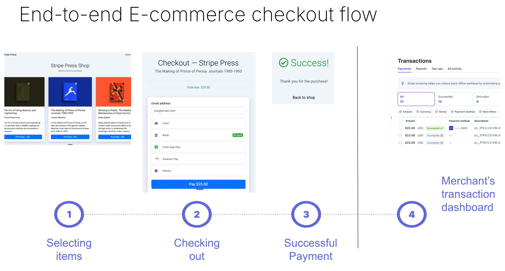
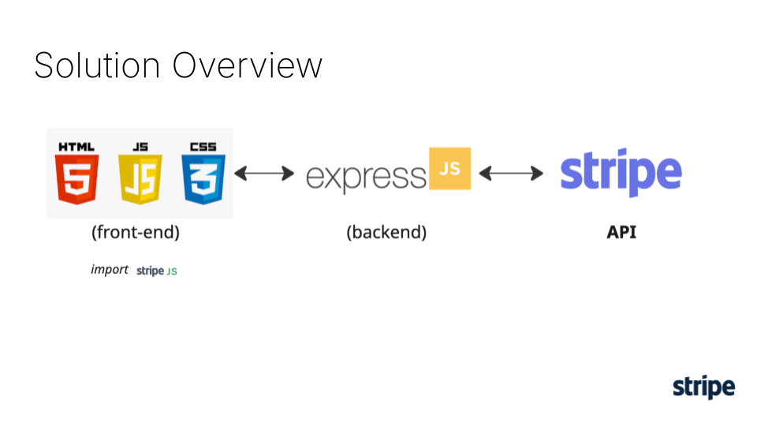
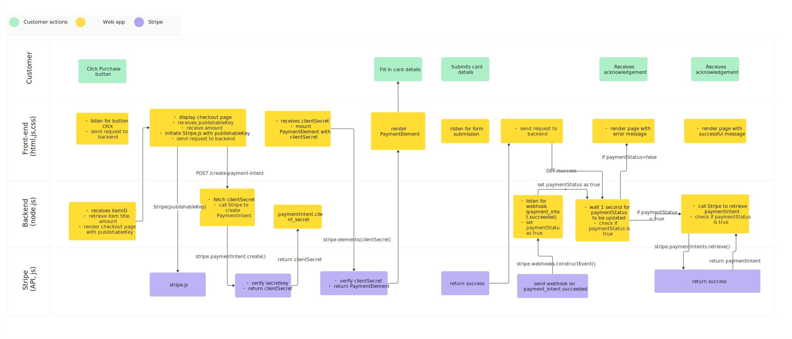

# Stripe PaymentIntent Integration — End-to-End E-commerce Checkout Flow

This project demonstrates how Stripe's PaymentIntent API works in a full end-to-end e-commerce checkout flow built with Node.js and Express.

## User Experience



[Link to slide presentation](https://docs.google.com/presentation/d/1k1B9CeRCdt0OZcQn5O1VHgqxxJLL9GuCt7T27p5FfHg/edit?usp=sharing)

[Link to video demo](https://www.youtube.com/watch?v=JLyaiIxpSBI)

---

## Objectives

This project demonstrates:

1. **Full payment lifecycle** — PaymentIntent creation to confirmation
2. **Security architecture**
   - Key management: Secret key vs Publishable key
   - Idempotency: API idempotency keys on PaymentIntent creation (implemented via `uuid`)
3. **Client-side Stripe.js library vs Server-side Stripe API**

   
## Why is this important for merchants?
1.  **Stripe helps organisation to reduce the burden of PCI compliance.**

By providing a variety of integration methods (E.g. Stripe Elements, separating front-end and back-end APIs) and security measures (E.g. key separation), Stripe ensures that sensitive data is captured and sent directly to Stripe's servers. Because the card numbers do not touch the application servers,  Stripe helps organisation to reduce the burden of PCI compliance.
[Read more here](https://stripe.com/guides/pci-compliance#how-stripe-helps-organizations-achieve-and-maintain-pci-compliance)


2. **Guaranteeing “exactly once” payment**

With Idempotency, Stripe supports safe retry requests without acceidentally performing the same operation twice.  [Read more here](https://docs.stripe.com/api/idempotent_requests)


## Extension of project (i.e. not part of current project):
-  **Timeout handling** — Retry logic and proper loading states for the success page
- **Additional payment methods** — Buy Now Pay Later (BNPL), bank transfers
- **Tax handling** — Stripe Tax integration
- **Shopping cart** — Support for multiple items per transaction
- **Database** — Replace in-memory `paymentStatus` object with persistent storage
- **Webhooks fulfillment** — Email delivery of purchase confirmation and content

---

## How to Build, Configure and Run

### Prerequisites
- Node.js installed
- Stripe account (free)
- Stripe CLI installed and logged in (required for local webhook listener)

### Setup

1. **Clone the repository and install dependencies:**
   ```bash
   git clone https://github.com/ongtingwei/stripe-paymentIntent-integration
   cd stripe-paymentIntent-integration
   npm install
   ```

2. **Configure environment variables:**

   Rename `sample.env` to `.env` and populate with your Stripe test API keys:
   ```
   STRIPE_SECRET_KEY=sk_test_...
   STRIPE_PUBLISHABLE_KEY=pk_test_...
   STRIPE_WEBHOOK_SECRET=whsec_...
   ```
   Generate your Stripe API keys at: https://dashboard.stripe.com/test/apikeys

3. **Run the application:**
   ```bash
   npm start
   ```

4. **Start the Stripe CLI webhook listener** (in a separate terminal):
   ```bash
   stripe listen --forward-to localhost:3000/webhook
   ```

   Pre-requisite: Stripe CLI has been installed from: https://docs.stripe.com/stripe-cli/install
 

5. **Navigate to http://localhost:3000 to view the app.**

---

## How Does the Solution Work?

### High Level Overview



### Architecture Pattern: MVC (Multi-Page Application)

| Layer | Implementation |
|-------|---------------|
| Model | `app.js` switch statement (item catalog) |
| View | Handlebars templates in `views/` |
| Controller | Express route handlers in `app.js` |

### End-to-End Flow



### Security Architecture

| Key | Where Used | Purpose |
|-----|-----------|---------|
| `STRIPE_SECRET_KEY` | Server only (`app.js`) | Creates and retrieves PaymentIntents |
| `STRIPE_PUBLISHABLE_KEY` | Browser (`custom.js`) | Initializes Stripe.js, renders Payment Element |
| `STRIPE_WEBHOOK_SECRET` | Server only (`app.js`) | Verifies webhook signature via `stripe.webhooks.constructEvent()` |

> **Card data never touches your server** — `stripe.confirmPayment()` sends card details directly from the browser to Stripe, maintaining PCI compliance.

---

## Stripe APIs and Documentation Used

- [PaymentIntent Object](https://docs.stripe.com/api/payment_intents/object)
- [PaymentIntent Create](https://docs.stripe.com/api/payment_intents/create)
- [PaymentIntent Retrieve](https://docs.stripe.com/api/payment_intents/retrieve)
- [stripe.confirmPayment()](https://docs.stripe.com/js/payment_intents/confirm_payment)
- [Stripe Elements](https://docs.stripe.com/js/elements_object)
- [Payment Element](https://docs.stripe.com/js/element/payment_element)
- [Idempotent Requests](https://docs.stripe.com/api/idempotent_requests)
- [Webhook Events](https://docs.stripe.com/webhooks)

---

## How I Approached This Problem

1. **Research** — YouTube videos, demos, and Stripe documentation to understand the art of possibility with Stripe integration
2. **Plan** — User flow design and solution architecture, understanding the boilerplate template and built-in resources
3. **Build, test, and improve** — Iterative development with testing at each step
4. **Document** — Architecture diagrams and workflow diagrams

### Resources Used

- [Stripe Workbench](https://dashboard.stripe.com)
- [YouTube — Stripe PaymentIntent walkthrough](https://www.youtube.com/watch?v=tmM1CyzJjIo)
- [Stripe Samples](https://github.com/orgs/stripe-samples/repositories)
- [Stripe accept-a-payment reference](https://github.com/stripe-samples/accept-a-payment/blob/main/payment-element/server/node/server.js)

---

## Learning Lessons

- **`receipt_email` may be null** if the PaymentIntent is created on page load — because the user has not entered their email yet. The workaround is to capture the email from the DOM `<input>` when confirming payment, and pass it via the `return_url` query parameter.
- **Webhook + paymentStatus pattern** — when implementing fulfillment logic, it should live in the webhook handler, not the `/success` route, to handle cases where the browser closes before the redirect completes.
- **Race condition** — the webhook and browser redirect happen simultaneously. A 1-second wait in the `/success` route accounts for this in development. Having a loop to wait for webhook will make it more robust. a database with polling is the production-grade solution.


---

## Self-Reflection

- *Appreciation* of Stripe's product design. Documentation is also easy to understand and navigate.
- Strong knowledge of web application technology is required — real-world customer platforms will be *significantly more complex* than this project, requiring continuous learning.
- Payment and transaction processing needs to be *relentlessly reliable*.

---
